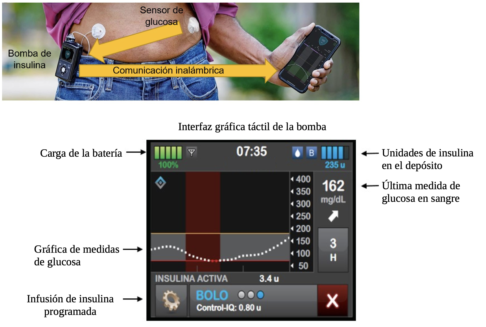

# InsulinPump-EmbeddedGUI

  

En esta práctica, desarrollé una interfaz gráfica de usuario (GUI) para una bomba de insulina destinada a pacientes con diabetes, utilizando la placa STM32F429I-DISC1. El objetivo era implementar una aplicación en lenguaje C que permitiera la interacción con una pantalla táctil resistiva integrada en la placa, gestionando la visualización de información médica relevante y el control del dispositivo.

La interfaz desarrollada simula el funcionamiento de una bomba de insulina real: recibe mediciones periódicas (cada 5 minutos) desde un sensor de glucosa, permite al usuario visualizar datos como el nivel actual de glucosa, la carga de batería, la cantidad de insulina en el depósito y un historial gráfico de las mediciones. Además, la GUI incluye modos de operación manual y automática, posibilitando tanto la programación de infusiones de insulina como la administración de bolus en momentos concretos.

Para implementar esta práctica, se utilizó el entorno de desarrollo STM32CubeIDE junto con FreeRTOS como sistema operativo en tiempo real. Se hizo uso de múltiples librerías proporcionadas para el manejo de la pantalla LCD, la interfaz táctil, y el renderizado gráfico de texto e imágenes, empleando buffers de imagen y formato ARGB.

--------------------------------------------------------------------------------------------------------------------------------------------------------------------------------

In this practice, I developed a graphical user interface (GUI) for an insulin pump intended for diabetes patients, using the STM32F429I-DISC1 development board. The goal was to implement a C-language application that enables interaction with the onboard resistive touchscreen, handling the display of relevant medical data and controlling the device's behavior.

The interface simulates the operation of a real insulin pump: it receives glucose measurements every 5 minutes from a wireless sensor, and displays key information such as current glucose level, battery charge, insulin units in the reservoir, and a graph of recent glucose data. The GUI also supports both manual and automatic operation modes, allowing scheduled insulin infusion and manual bolus injections at specific times (e.g., after a meal).

The development was carried out using STM32CubeIDE and FreeRTOS as the real-time operating system. Several provided libraries were used to manage the LCD screen, touchscreen interface, and graphical rendering of text and images, using frame buffers and the ARGB color format.

